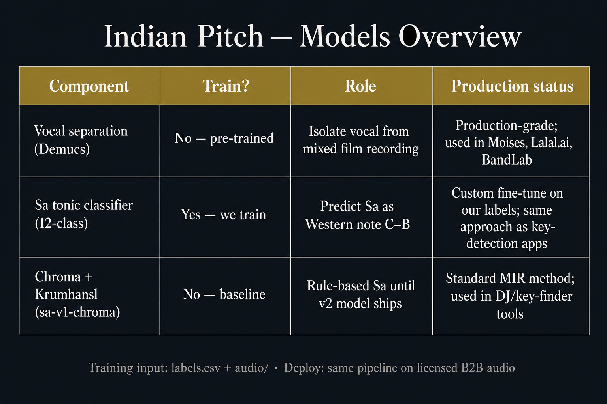

# Models overview

| Component | Train? | Role | Production use |
|-----------|--------|------|----------------|
| **Vocal separation (Demucs)** | No — pre-trained | Isolate vocal from mixed film recording | Meta’s open-source SOTA separator; same class of tech used in **Moises**, **Lalal.ai**, **BandLab** |
| **Sa tonic classifier (12-class)** | **Yes — we train** | Predict Sa as Western note (C–B) | Custom fine-tune on our labels; same *approach* as key/tonic apps (Mixed In Key, Tunebat, etc.) |
| **Chroma + Krumhansl (`sa-v1-chroma`)** | No — baseline | Rule-based Sa until v2 ships | Standard music-IR method; used in DJ tools and key finders |

**Training input:** `labels.csv` + `audio/` (verified rows only)  
**Deploy:** same pipeline on licensed B2B audio — labels are not used at lookup time
